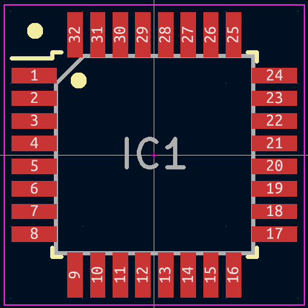
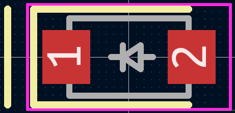

# OEM Parts
KiCad libraries employed by Olin Electric Motorsports electrical team.

# Setup

> Prior to Mk. V we used a global library, however it was poorly maintained and many of the components are no longer available for purchase. New projects should use the parts library for the appropriate vehicle.

Open KiCad. From the top bar, open up _Preferences > Manage Symbol Libraries..._. Add new rows to the table:

Nickname | Library Path
---|---
formula |`${OEM_DIR}/parts/schematic/formula.kicad_sym`
MkVI | `${OEM_DIR}/parts/schematic/mkvi.kicad_sym`

From the top bar, open up _Preferences > Manage Footprint Libraries..._. Add new rows to the table:

Nickname | Library Path
---|---
footprints |`${OEM_DIR}/parts/footprints.pretty`
MkVI | `${OEM_DIR}/parts/mkvi.pretty`

# Guidelines

## Symbols

Applies to all symbols in the `MkVI` library. When a new schematic symbol is added it should be checked against these guidlines.

### Naming

For specific parts such as ICs, use the general part number (e.g. `ADBMS1818` not `ADBMS1818-WASZ-RL`). For passives and other generic components, a descriptive (e.g. `R_200`) name is suitable.

### Required Fields

Field | Example | Show |  Description
--- | --- | --- | ---
Reference | `R` | Y | [Letter corresponding to component type](https://klc.kicad.org/symbol/s6/s6.1/)
Value | `10K` | Y |  Value of component or part name
Footprint | `MkVI:R_0805` | N | Reference to footprint for component
Datasheet | `https://www.example.com/.../datasheet.pdf` | N | Link to datasheet
MPN | `RCA080510K0FKEA` | N | Manufacturer Part Number for ordering
MFN | `Vishay` | N | Manufacturer (not to be confused with distributors like digikey)
ReorderAt | `50` | N | Approximate quantity at which to order more, 0 if additional units should not be ordered
SuggestedQuantity `100` | N | Suggestion for quantity to order when running low
Location | `Bin 7, A12` | N | Set once components arrive, location in storage
NewDesigns | `Yes` | N | If the component should be used in new designs. If a component should not be used set to `DO NOT USE` and enable `Show`.

### Required Metadata

Property | Notes
--- | ---
Symbol Name | Do not include formula, OEM, MkVI, etc.
Description | Part description for search
Keywords | Comma separated list of search terms

### Component Specific Fields

In addition to the required fields, some component types have additional required fields to help with design reviews. If there is any specification you think is important to the component, add it as a field in addition to the required fields.

#### ICs

Field | Example | Show |  Description
--- | --- | --- | --- | 
SupplyVoltage | `2.5-5.5V` | N | The supply voltage for the IC
LogicLevel | `5V` | N | If applicable, the logic level for IO

#### Connectors

Field | Example | Show |  Description
--- | --- | --- | --- | 
RatedVoltage | `600VDC` | N | Rated voltage - must be documented in datasheet or link source
ContactCurrent | `.8A` | N | Rated current per contact
MatesWith | `MPNABCD` | N | Symbol name of mating connector. If there are multiple mating connectors `MatesWithAltX` fields may be added.

#### Passives

The relevant specifications vary for different passives. Make sure any specifications that were relevnt to your selection are included as fields and listed in the description. This makes finding suitable alternatives easier if there are supply issues.

### Symbol Design

1. If multiple pins should **always** be connected together, use [pin stacking](https://klc.kicad.org/symbol/s4/s4.3/).
    - Do not stack power pins if they require seprate decoupling capacitors
1. Pin orientation
    * Power pins should be placed on the top of the symbol
    * GND pins should be placed on the bottom of the symbol
    * Input pins should be placed on the left of the symbol
    * Output pins should be placed on thr right of the symbol
    * For some components, pins can function as inputs or outputs. In this case they should be placed on the right of the component.
1. Pins should be grouped functionally, not based on pin order

## Footprints

Applies to all footprints in the `MkVI` library. When a new footprint is added it should be checked against these guidlines.

Do not create footprints for specific components, create footprints for packages so that they can be reused. Add alternate package names to the description.

In the rare case that a component does not have a package name, the symbol name should be matched exactly.

### Naming

We loosely follow the [KiCad Library Conventions for footprint names](https://klc.kicad.org/footprint/f3/). Generally, we err on the side of slightly simpler, easier to remember footprint names.

For example, we omit the metric sizing in SMT passives (i.e. `R_0805` instead of `R_0805_2012Metric`).

For connectors, we follow `[Series]_[PinLayout]_[Orientation]`. For example, `MicroFit_2x4_RA`.

Orientation | Shorthand
--- | ---
Vertical | VT
Horizontal | RA
45 degree | 45

### Required Fields

Field | Example | Show |  Description
--- | --- | --- | --- | 
Source `https://example.com/.../mpn.pdf` | N | Datasheet with footprint drawing.

### Required Metadata

Property | Notes
--- | ---
Symbol Name | Do not include formula, OEM, MkVI, etc.
Description | Part description for search. Include alternate package names
Keywords | Comma separated list of search terms

### Footprint Design
Getting footprints online is encouraged, but sometimes they aren't perfect.

1. On ICs, Pin 1 should be marked with two dots and an extended line over the pin. The dot should have a radius of 0.3mm.
    
1. The polarity of components should be indicated with a 0.3mm dot placed outside the component body near the cathode. The component outline should be incomplete and exclude the anode.
    
1. Silksreen designs should be drawn with a line width of 0.12mm`

## 3DModels

All footprints must include a 3D Model.

All 3D Models should be placed in the `MkVI.3dshapes`. Do not create subdirectories for 3D models. Add only the 3D model files required for each component. The name of each file should match the associated footprint. If multiple footprints use the same 3D model, the name should match the most generic footprint.

If possible, models should not require positioning or scaling to match the footprint.

